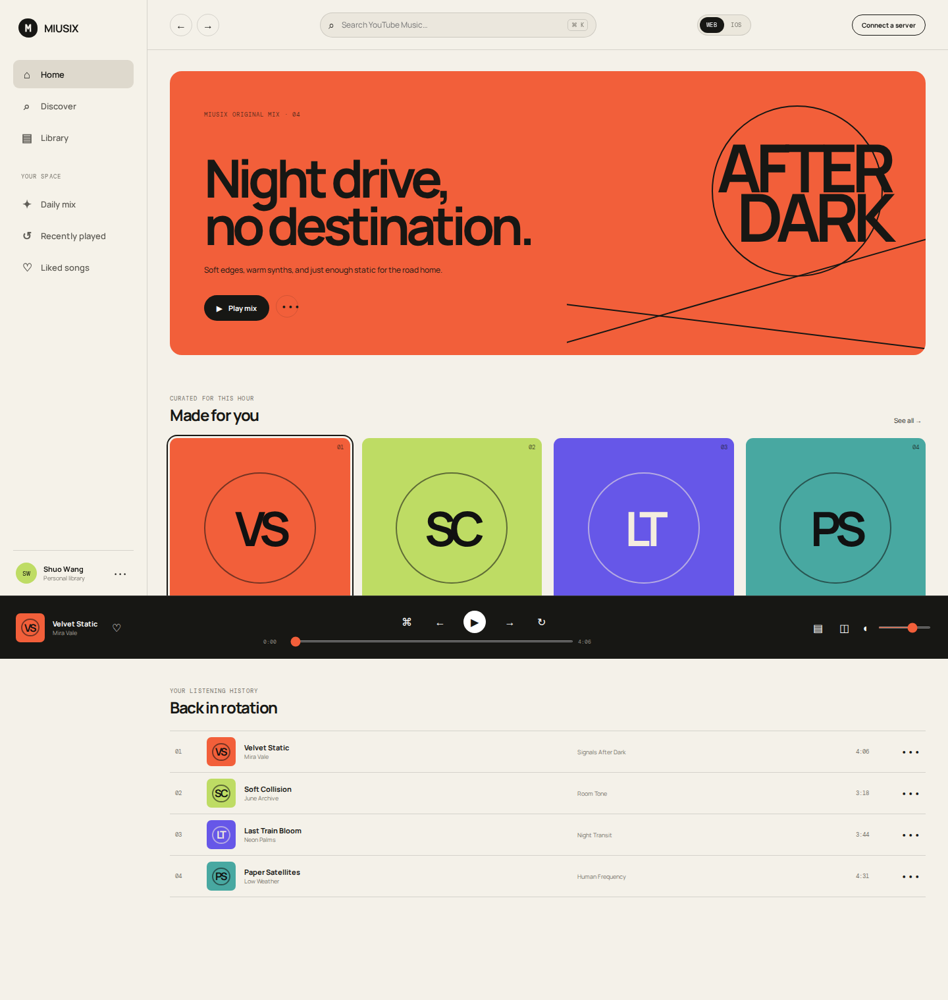
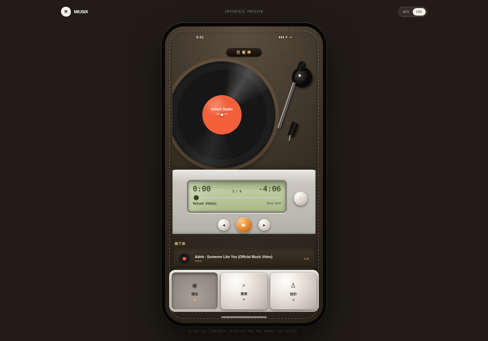
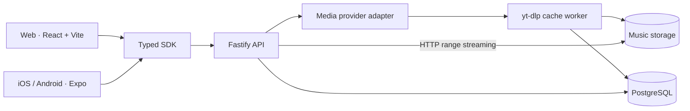

<div align="center">

# MIUSIX

### Your music. Your server. Every screen.

An expressive, self-hosted music experience for the web, iOS, and Android.

[](https://miusix.vercel.app)
[](https://pre-miusix.vercel.app)



</div>

## Music software with a point of view

Miusix pairs a bold editorial interface with a backend you can run yourself.
The browser player, native client, API, shared contracts, and deployment setup
live together in one TypeScript monorepo—so the experience can evolve as one
product instead of a collection of disconnected apps.

| Own the stack | Move between screens | Stream naturally |
| --- | --- | --- |
| Run the API, database, proxy, and media storage on your infrastructure. | Share typed contracts between React on the web and Expo on mobile. | Seek through audio efficiently with HTTP range requests. |

## Made for every screen

<div align="center">
  
</div>

Switch the hosted player between the full Web workspace and a focused iOS
device preview. The Expo client carries the same product language into the
dedicated iOS and Android apps.

## A small loop that actually works

- Search through the configured media provider.
- Cache an authorized result through the self-hosted API.
- Stream it with seekable HTTP range requests.
- Keep favorites between browser sessions.
- Move between Web and iOS views without losing the active track.

## What is inside

```text
miusix/
├── apps/
│   ├── web/          Vite + React web player
│   ├── mobile/       Expo client for iOS and Android
│   └── api/          Fastify API and audio streaming
├── packages/
│   ├── contracts/    Shared Zod schemas and TypeScript models
│   └── sdk/          Typed API client for every frontend
├── infra/            Caddy reverse-proxy configuration
├── storage/media/    Local music library (ignored by Git)
└── docker-compose.yml
```



## Start listening

### Docker Compose

The quickest way to run the complete self-hosted stack:

```bash
cp .env.example .env
# Set a strong POSTGRES_PASSWORD in .env
# Set ENABLE_YOUTUBE_IMPORTS=true only for media you may save.
docker compose up --build -d
```

Caddy serves the web app and proxies `/api/*` to the API. PostgreSQL data is
kept in a named volume, while cached audio stays in `storage/media`.

You can also place local MP3 files in `storage/media` using the track UUID:

```text
storage/media/45a6ad78-bdd2-4f5e-9737-4858c929f238.mp3
```

### Local development

Requirements: Node.js 22+, npm, and `yt-dlp` for provider search/import.

```bash
npm install
cp .env.example .env
npm run dev:api
```

Open a second terminal for the web player:

```bash
npm run dev:web
```

Then open `http://localhost:3000`. The API listens on
`http://localhost:4000`.

For the native client:

```bash
npm run dev:mobile
```

Expo will provide QR codes and launch options for iOS, Android, and mobile web.

## Technology

| Layer | Built with |
| --- | --- |
| Web | React 19, Vite 8, TypeScript |
| Mobile | React Native, Expo |
| API | Fastify, PostgreSQL |
| Provider adapter | yt-dlp child process |
| Shared code | npm workspaces, Zod, typed SDK |
| Self-hosting | Docker Compose, Caddy |
| Web delivery | Vercel |

## Useful commands

```bash
npm run typecheck     # Check every workspace
npm run build         # Build all buildable workspaces
npm run dev:web       # Start the web player
npm run dev:api       # Start the API
npm run dev:mobile    # Start Expo
```

## Deployment

The static web player is configured for Vercel at the repository root:

- Production: [miusix.vercel.app](https://miusix.vercel.app)
- Preview: [pre-miusix.vercel.app](https://pre-miusix.vercel.app)
- Build command: `npm run build --workspace @miusix/web`
- Output directory: `apps/web/dist`

The API is designed for your own server. Use `docker-compose.yml` for a
complete deployment, or build the service-specific Dockerfiles under
`apps/api` and `apps/web`. See the
[backend deployment guide](docs/backend-deployment.md) for sizing, storage,
database design, and host recommendations.

## On the record

- [x] Responsive web listening experience
- [x] Shared contracts and typed client
- [x] Search, cache, play, and favorite loop
- [x] Web / iOS interface switch
- [x] Opt-in yt-dlp provider adapter
- [x] HTTP range audio streaming
- [x] Docker-based self-hosting
- [x] iOS and Android application foundation
- [ ] Authentication and multi-user libraries
- [ ] Background job queue and retry dashboard
- [ ] Background metadata and artwork processing
- [ ] Object-storage support

## Keep secrets off the stage

Never commit `.env` files. Begin with `.env.example` and store production
values in your deployment platform or server secret manager.

An earlier version of this repository tracked local credentials. If you used
that version, rotate its Supabase, PostgreSQL, and Vercel credentials; deleting
the file from the current tree does not remove it from Git history.

The YouTube adapter is disabled by default. YouTube's terms restrict
downloading except where the service, YouTube, the rights holder, or applicable
law permits it. Only enable imports for content you own or are authorized to
save; Miusix does not include DRM, authentication, or paywall bypasses.

<div align="center">

Built for late nights, long drives, and libraries worth keeping.

</div>
